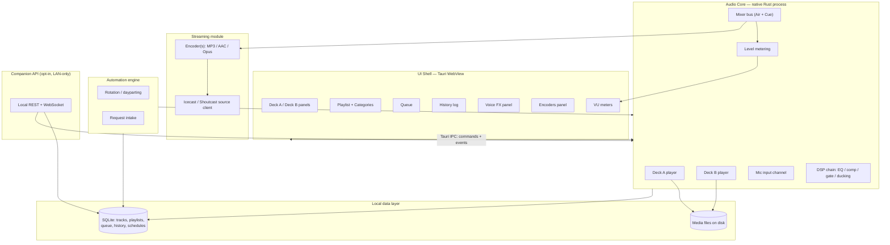
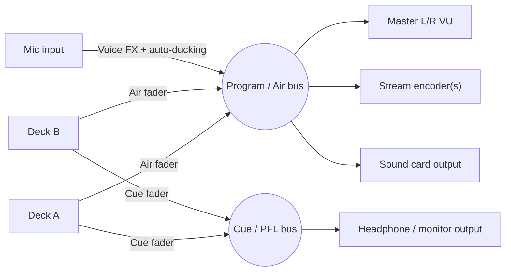
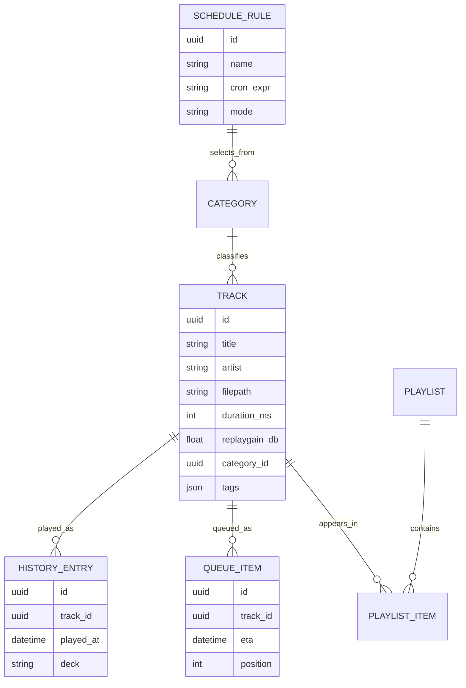
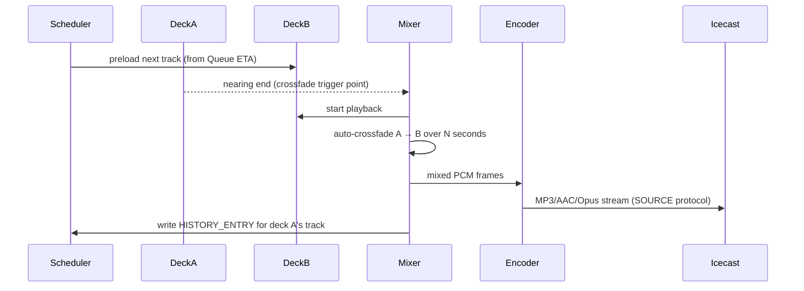

# Wavecast — Architecture Schematics

Working title for a personal, proprietary, OS-agnostic replacement for
**SAM Broadcaster PRO** (Spacial Audio Solutions). This document is the
design schematic for the system: components, signal flow, data model, and
the technology decisions behind them. No code exists yet — this is the
blueprint to build from.

## 1. Why replace it

SAM Broadcaster PRO ("SAM" = Spacial Audio Manager, hence the product's
audio-centric branding) is dual-deck DJ/automation software built for
running an internet radio station solo: two playback decks, a rotation
playlist, a request queue, a played-tracks history log, mic processing for
live voice breaks, and one or more streaming encoders feeding
Icecast/Shoutcast.

As of 2026 the product is effectively stalled — no releases since April
2025, "lifetime" licenses that now require annual renewal, and an
ownership change users describe as having stripped the product down. That's
the case for owning a personal build instead of continuing to rent access
to abandonware.

Design goals for the replacement:

- **Feature-equivalent** to daily SAM Broadcaster PRO usage (see §2).
- **OS-agnostic**: one codebase, native installers for Windows, macOS, and
  Linux.
- **Local-first**: no server, no account, no cloud dependency to play music
  and go live. A remote/companion API is opt-in, LAN-only by default.
- **Proprietary/personal**: single-user, no licensing-server nonsense, no
  telemetry.

## 2. Feature inventory (from current usage + the SAM Broadcaster UI)

Mapped from the reference screenshot (Deck A/B, Queue, History, Voice FX,
Encoders panel) plus how the software is actually used day to day:

| Area | Capability |
|---|---|
| **Playback decks** | Two independent decks (A/B) with play/pause/stop/next, scrub position, elapsed/remaining time, bitrate/sample-rate display, per-deck volume/pan/trim, Air and Cue (pre-listen) routing |
| **Mixing** | Auto-crossfade between decks on track end, manual crossfader, master Air bus, separate Cue/PFL bus to headphones |
| **Playlist / library** | Track library with categories (e.g. "The Parlor," "Heaven And...", genre folders), per-category rules, "Float" vs "Target" playlist positioning |
| **Queue** | Upcoming-track queue with computed ETA per item, drag-reorder, duration display |
| **History** | Timestamped log of everything played (artist/title/time), running total track count and elapsed session time — needed for royalty/performance reporting |
| **Voice FX / mic** | Push-to-talk or locked-open mic channel, independent music/mic volume faders, EQ, Auto-ducking of music under voice, Air/Cue routing for the mic path |
| **Metering** | Per-deck and master L/R VU meters in dB, peak/viewer counters |
| **Streaming encoders** | One or more simultaneous encoder profiles (format/bitrate) pushed to Icecast2/Shoutcast v2 mount points, start/stop per encoder, DSP insert per encoder |
| **Automation** | Unattended rotation playback when no one's driving, scheduled dayparting |
| **Workspace** | Multiple saved desktop layouts (the screenshot's "Desktop A/B/C" switcher), dockable/closable panels |

## 3. System architecture

Two-process split, same machine: the **UI shell** is a Tauri webview
(HTML/CSS/JS front end) that never touches audio directly — it only sends
commands ("play deck A", "set fader 0.8") and receives events (meter
levels, now-playing, queue changes) over Tauri's IPC. The **audio core** is
a native Rust binary that owns the real-time audio thread, decoding,
mixing, and encoding. This keeps UI redraws and garbage collection off the
audio callback path, which is where clicks/dropouts come from in
Electron-style single-process designs.

## 4. Signal flow / mixer

Auto-ducking: when the mic gate opens, the DSP chain applies a fast
attack/slow release gain reduction to the music path feeding `MixBus`
(matching the reference UI's "Auto" mic mode), independent of the Cue bus
so the operator can always pre-listen at full volume.

## 5. Data model

Stored as a single SQLite file in the platform app-data directory —
no server, trivially backed up, portable between machines.

## 6. Playback → crossfade → stream (sequence)

## 7. Technology stack

| Layer | Choice | Rationale |
|---|---|---|
| UI shell | **Tauri 2** | Native OS webview instead of bundled Chromium: ~3 MB base vs Electron's ~150 MB, lower idle RAM, and a Rust backend that shares a process boundary cleanly with the audio core. Electron remains the fallback if a specific web-audio-visualization library turns out to need full Chromium. |
| UI framework | Svelte (or React) | Frequent, small DOM updates (VU meters, elapsed time) favor Svelte's compiled reactivity; React is an acceptable substitute if team familiarity matters more. |
| Audio core language | **Rust** | Predictable low-latency audio callback, no GC pauses, one toolchain that cross-compiles to all three target OSes. |
| Audio I/O | `cpal` | Abstracts WASAPI (Windows), CoreAudio (macOS), ALSA/PulseAudio/JACK (Linux) behind one API. |
| Decoding | `symphonia` | Pure-Rust MP3/AAC/FLAC/OGG/WAV/ALAC decoder, no system codec dependency. |
| Resampling | `rubato` | Sample-rate matching across decks and output device. |
| DSP (EQ/comp/gate) | `fundsp` or hand-rolled biquad chain | Small, dependency-light, enough for parametric EQ + compressor + noise gate. |
| Local DB | SQLite via `rusqlite` | Zero-config, file-based, matches "no server" goal. |
| Streaming output | Raw Icecast/Shoutcast **SOURCE** protocol client + `mp3lame`/`libopus`/`fdk-aac` bindings as available | Opus/Vorbis (BSD-licensed) as the default codec to avoid MP3 (LGPL, needs a system LAME) and fdk-aac (restrictive license) entangling a proprietary build; MP3 support stays available for listener compatibility via the system codec when present. |
| Companion/remote API | `axum` embedded in the Rust core | LAN-only by default, bearer-token auth, opt-in — for a phone "now playing + play/pause" remote later. |
| Packaging | Tauri bundler + Tauri updater plugin | Native installers (`.msi`, `.dmg`, `.AppImage`/`.deb`) from one build matrix; self-hosted update feed since this isn't going through app stores. |

## 8. Build phases

1. **MVP** — Deck A/B playback with auto-crossfade, playlist + queue +
   history, single Icecast/Shoutcast MP3/Opus encoder, VU meters. Enough
   to actually go live solo.
2. **Voice** — mic channel, Voice FX (EQ/compressor/gate), auto-ducking,
   push-to-talk and locked-open modes.
3. **Automation** — category-based rotation rules (Float/Target),
   dayparting scheduler, multiple simultaneous encoder profiles, listener
   request intake.
4. **Extensibility** — VST3/CLAP plugin hosting for third-party DSP,
   companion remote-control app, multi-machine library sync (still
   self-hosted, opt-in).

## 9. Non-goals

- No multi-tenant/hosted mode — this is a single-user desktop tool, not a
  SaaS.
- No mandatory account or license server.
- No telemetry by default.
